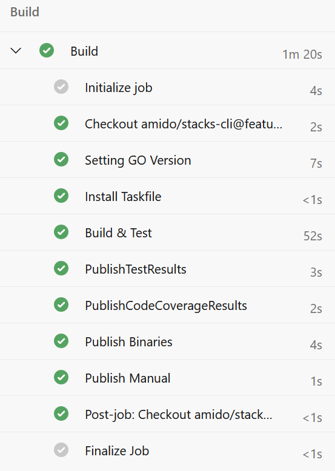
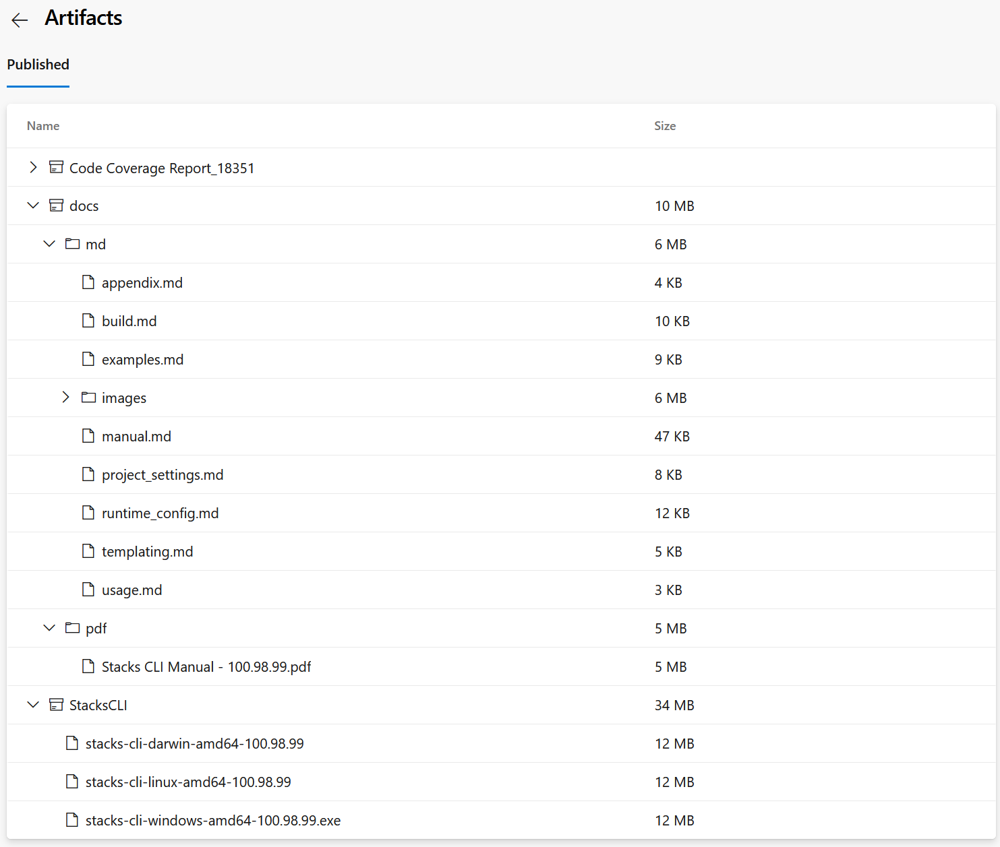

# Build

A build pipeline file exists in `./build` that controls how the CLI is compiled in Azure DevOps.

The build consists of three files:

| Name | Description |
|---|---|
| `azuredevops-pipeline.yml` | Main pipeline file that AzDo uses to run the build |
| `azuredevops-compile.yml` | Template file that is repeatedly called for each of the target platforms for the CLI |
| `azuredevops-vars.yml` | Variable template file containing variables for the build |

## Template Build file

By using the template build file, it is possible to make Azure DevOps create the entire pipeline without it having to be explicitly configured.

For example, the following snippet is from the `azuredevops-pipeline.yml` file:

```yaml
      - template: azuredevops-compile.yml
        parameters:
          platforms: 
            - os: linux
              arch: amd64
              file_extension:
            - os: darwin
              arch: amd64
              file_extension:     
            - os: windows
              arch: amd64
              file_extension: .exe
```

In this case the template file would be called three times, and on each time it will pass in the platform details. At the end of the build there would be three binaries as a result of the compilation. This makes it very easy to add another platform without having to explicitly write it out.

When the build runs, Azure DevOps will expand out the build into _all_ the steps it creates:



All of the compile binaries are copied up to the artefact directory in Azure DevOps.

